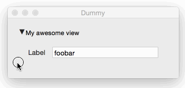
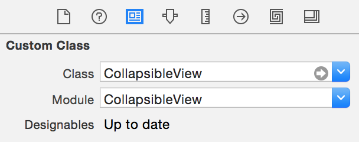
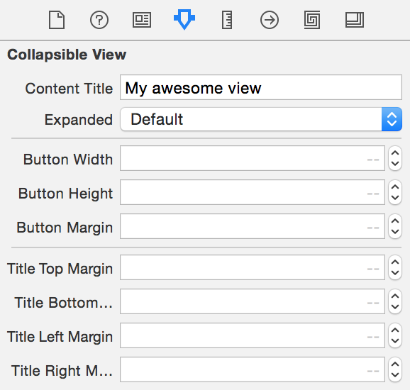
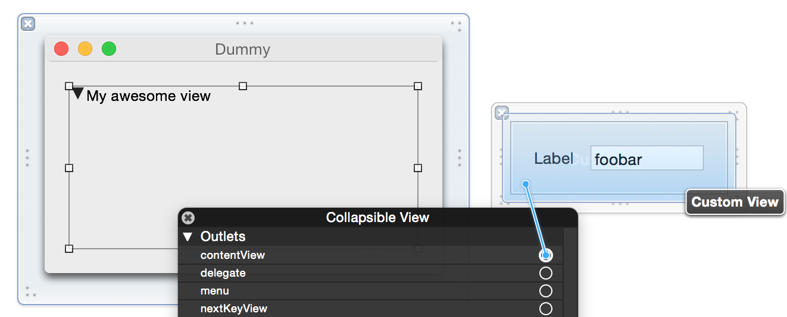

## CollapsibleView
`CollapsibleView` is a subclass of `NSView` that shows the user a disclosure indicator / title and allows them to collapse/expand the contained *contentView*. 

Conceptually, it looks something like:

	+---------------------------+
	| > A title goes here       |
	+---------------------------+

and when the user clicks on the disclosure indicator, it toggles to:

	+---------------------------+
	| v A title goes here       |
	+---------------------------+
	|                           |
	|     your contentView      |
	|                           |
	+---------------------------+

## Usage
`CollapsibleView` is designed to be used in InterfaceBuilder (I am sure it will work programmatically too), and there are a number of properties that are exposed as `IBOutlet` or `IBDesignable` to allow you to easily customise various behaviours and settings.

To add a `CollapsibleView` to your window/view, simply drag a *Custom View* to wherever you want it. Then in the *Identity Inspector* change the type to be `CollapsibleView`.

Then, in the *Attributes Inspector*, you can set a number of properties (the most likely will be the title and whether the view should initially be expanded or collapsed. 

Then, create a separate *Custom View* that contains the collapsible content. In the screenshot below, you can see a simple view with a label and a text field.

The last thing is to connect your content view to the `contentView` outlet of the CollapsibleView. 

You can also optionally connect the `delegate` outlet to a class that implements `CollapsibleViewDelegate`.

## Installation
### Copy / Paste
You can simply copy `CollapsibleView.swift` into your project.

### Carthage
Add the following line to your `Cartfile` file:

	github "edwardaux/CollapsibleView" "v1.0"
	
and run `carthage update`.